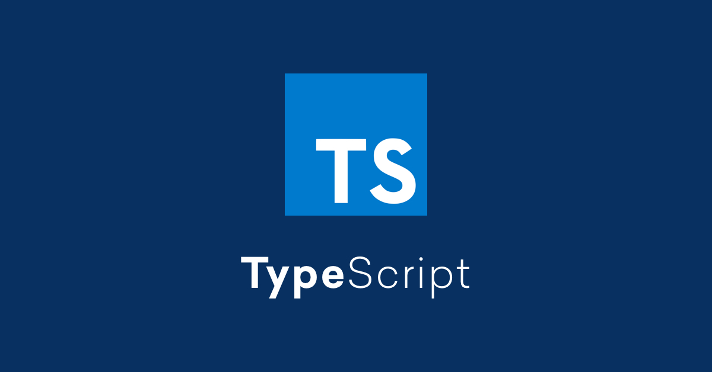

# TypeScript Learning Repository 📘

A curated collection of TypeScript concepts, examples, and hands-on code snippets. This repository documents my learning journey and serves as a quick reference for developers exploring TypeScript



### Topics Covered

- 📌 Why learn TypeScript
- 🧠 Misconceptions about TypeScript
- ⚙️ Setting up TypeScript
- 📖 Introduction to the official docs
- 🔢 Number, Boolean, and Type Inference
- 🚫 The problem with `any`
- 🛠️ Functions (basic to advanced)
- 🧱 Object structures and behaviors
- 🏷️ Type Aliases
- 🔐 Readonly & Optional properties
- 🧮 Working with Arrays
- 🔀 Union Types
- 📦 Tuples
- 🎖️ Enums
- 📄 Interfaces
- ⚔️ Interface vs Type
- 🧰 Project setup with TS
- 🧱 Classes and modifiers (public/private/protected)
- 🧲 Getters & Setters
- 🛡️ Abstract Classes
- 🔁 Generics and their applications
- 🕵️‍♂️ Type Narrowing
- 📍 Type guards: `in`, `instanceof`, and predicates
- ⚖️ Discriminated unions & `never` for exhaustive checks

## 🗂️ Repository Structure
Each file or folder represents a concept or topic covered in the course. Browse them freely or follow in order.

## 🚀 Getting Started

1. **Clone the repository**
   ```bash
   git clone https://github.com/megh-bari/typescript.git
   ```

2. **Navigate into the project**
   ```bash
   cd typescript
   ```

3. **Install TypeScript (globally or locally)**
   ```bash
   npm install -g typescript
   ```

4. **Compile a `.ts` file**
   ```bash
   tsc filename.ts
   ```

5. Start learning! Open any folder, run the code, and experiment.

## 📚 Resources

Here are some helpful links to deepen your TypeScript knowledge:

- [Official TypeScript Docs](https://www.typescriptlang.org/docs/)
- [TypeScript Playground](https://www.typescriptlang.org/play)
- [TSConfig Reference](https://www.typescriptlang.org/tsconfig)
- [Type Challenges (Advanced Practice)](https://github.com/type-challenges/type-challenges)
- [Youtube Video](https://youtu.be/30LWjhZzg50?si=kBwi0HKrtNJOOBRJ)

## Author 
 This repo is maintained by [Megh bari](https://github.com/megh-bari)

## Happy Coding 🎈